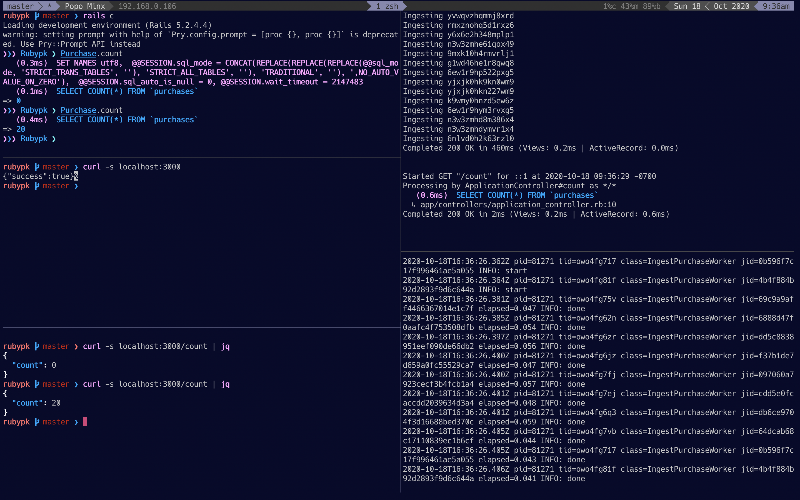

# RubyConf Pakistan

## Organizing Business Logic & Async Processing (October 2020)

* * *

This project serves to highlight how easy it is to integrate the following
rubygems:
* [Interactor](https://github.com/collectiveidea/interactor) for organizing
business logic
* [Sidekiq](https://github.com/mperham/sidekiq) for async processing

This goes along with the
[corresponding presentation](https://docs.google.com/presentation/d/1X9zGWnm4o9laIN7ZtOQBXZb3z-e24vfFYSrRjfG5uLw).
